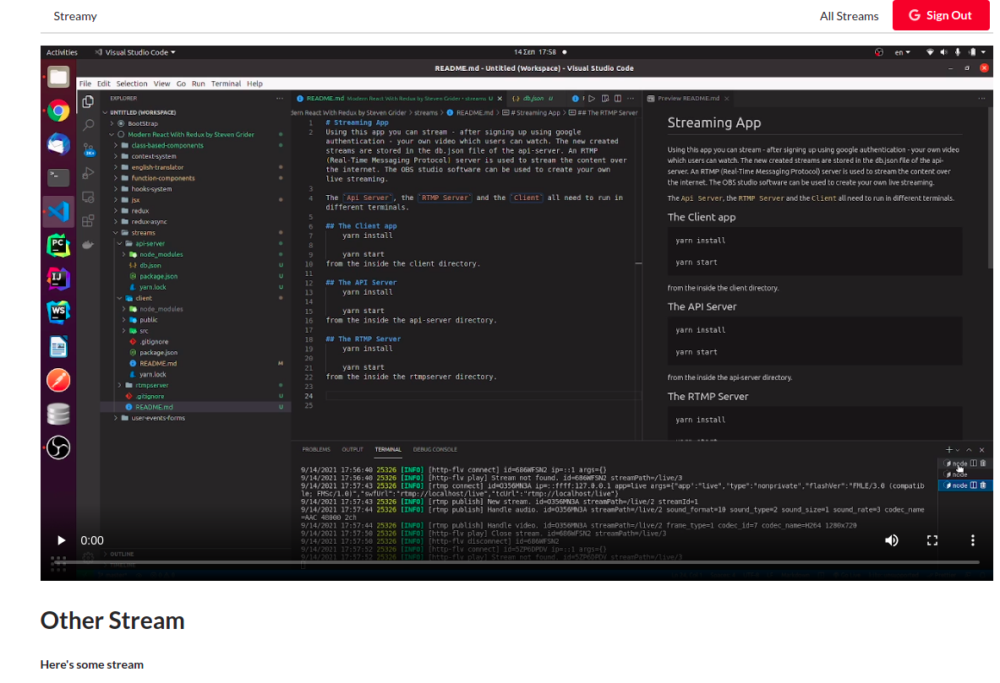

# Streaming App
Using this app you can stream - after signing up using google authentication - your own video which users can watch. The new created streams are stored in the db.json file of the api-server. An RTMP (Real-Time Messaging Protocol) server is used to stream the content over the internet. The OBS studio software can be used to create your own live streaming.

The `Api Server`, the `RTMP Server` and the `Client` all need to run in different terminals.

## The Client app
    yarn install

    yarn start
from the inside the client directory.

## The API Server
<https://www.npmjs.com/package/json-server>

    yarn install

    yarn start
from the inside the api-server directory.

## The RTMP Server
<https://www.npmjs.com/package/node-media-server>

Using with OBS studio: <https://github.com/illuspas/Node-Media-Server>

    yarn install

    yarn start
from the inside the rtmpserver directory.

### Landing page

### Landing page after google authentication

### Form to create your own stream

### Live streaming

